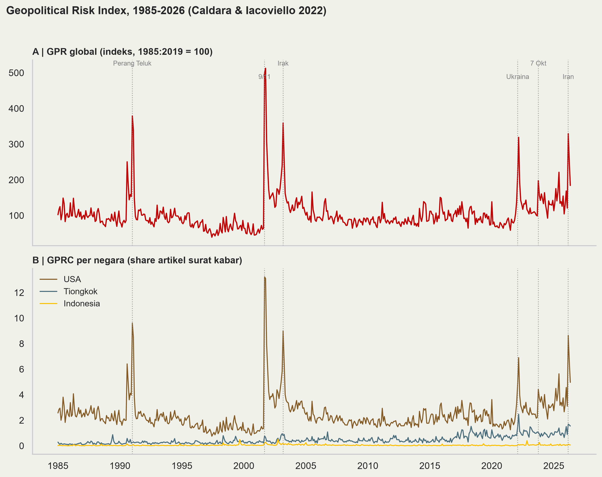
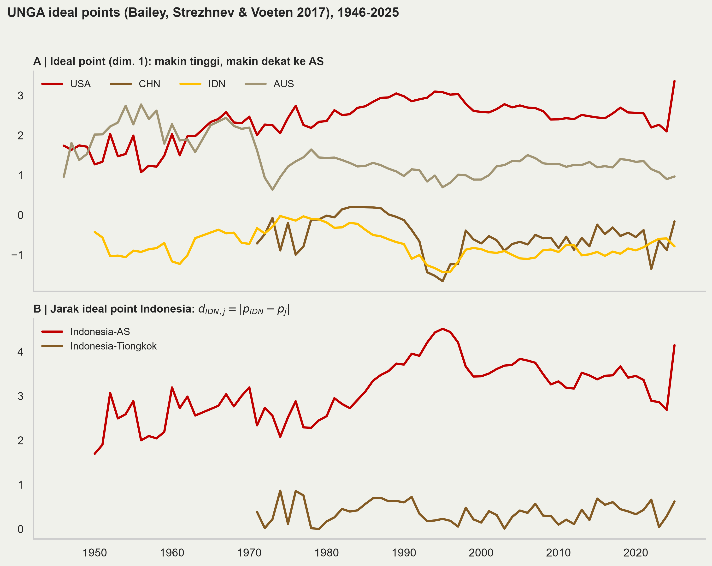
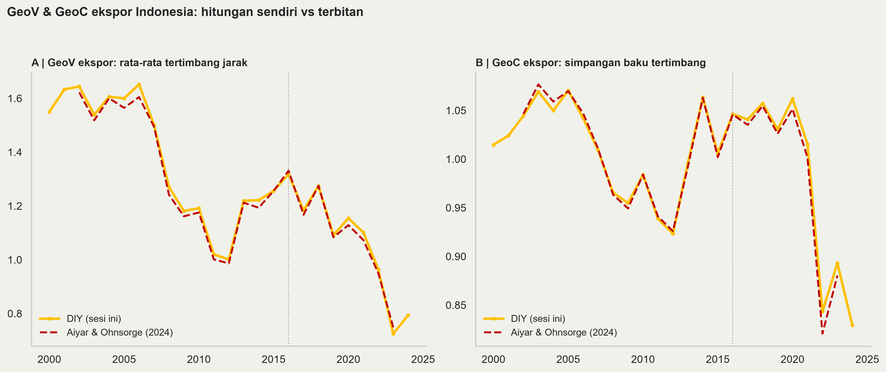
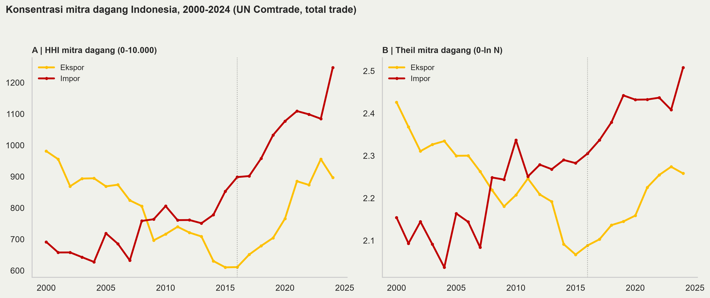

## Tujuan sesi ini

- Kita coba menghitungnya sendiri, dari data publik, dengan Python.

- Empat latihan:
  1. **GPR** — risiko geopolitik global, USA, Tiongkok, Indonesia;
  2. **Ideal points** — menarik data keselarasan politik dari voting PBB;
  3. **GeoV & GeoC** — membangun indikator Aiyar-Ohnsorge dari nol;
  4. **HHI & Theil** — konsentrasi mitra dagang Indonesia.

- Prinsip: semua **reproducible**: data publik, kode terbuka, angka di slide ini semuanya keluaran skrip.

## Setup {.m}

Struktur folder (bisa di-clone dari GitHub):

```
sesi5/
  sesi5.qmd     # slide ini
  README.md     # instruksi + tabel sumber data
  code/         # 01_gpr.py ... 04_hhi_theil.py
  data/         # semua input (~9 MB, sudah disertakan)
  figures/      # output PNG
```

Kebutuhan: Python (Anaconda) + `pandas numpy matplotlib xlrd`, gaya figur [fig-den](https://github.com/den-econ/fig-den), dan [Quarto](https://quarto.org).

| Data | Sumber |
|---|------|
| GPR | matteoiacoviello.com/gpr.htm |
| Ideal points | Harvard Dataverse doi:10.7910/DVN/LEJUQZ |
| Trade bilateral IDN | UN Comtrade (`comtradeapicall`) |
| GeoV/GeoC (validasi) | Harvard Dataverse doi:10.7910/DVN/PGCQVD |

# Latihan 1 — Geopolitical Risk Index

## Konsep GPR {.m}

- Caldara & Iacoviello (2022): risiko geopolitik diukur dari **frekuensi pemberitaan** — share artikel di 10 surat kabar besar yang memuat kata kunci perang/ketegangan/terorisme.

- **GPR** = indeks global (rata-rata 1985–2019 = 100); **GPRH** = versi historis sejak 1900.

- **GPRC_XXX** = indeks spesifik negara (44 ekonomi): share artikel yang menyebut negara itu dalam konteks risiko geopolitik.

- Satu file Excel, bulanan, gratis: `data_gpr_export.xls`.

## Kode inti (`01_gpr.py`) {.m}

```python
raw = pd.read_excel("data/gpr_raw.xls", sheet_name="Sheet1")
raw["year"] = raw["month"].dt.year
annual = raw.groupby("year")[["GPR", "GPRC_USA",
                              "GPRC_CHN", "GPRC_IDN"]].mean()

axA.plot(annual.index, annual["GPR"])            # panel A: global
for col in ["GPRC_USA", "GPRC_CHN", "GPRC_IDN"]: # panel B: per negara
    axB.plot(annual.index, annual[col])
```

Tiga baris pertama adalah 90% pekerjaannya: baca, agregasi bulanan → tahunan, plot.

## Hasil {.m}

{fig-align="center" width="72%"}

Rata-rata 2022–26 vs 2010–19: global **1,6×**, USA **1,8×**, Tiongkok **2,0×**, Indonesia **2,4×** — level GPRC Indonesia kecil (kita jarang jadi subjek berita risiko), tetapi kenaikan relatifnya justru paling tajam.

# Latihan 2 — UNGA ideal points

## Menarik ideal points {.m}

- Bailey, Strezhnev & Voeten (2017): posisi politik negara diestimasi dari **pola voting Majelis Umum PBB** 1946–kini → satu angka per negara-tahun, *ideal point* (dim. 1: makin tinggi = makin dekat tatanan liberal pimpinan AS).

- Cara menarik datanya:
  1. Buka <https://doi.org/10.7910/DVN/LEJUQZ> (Harvard Dataverse);
  2. Unduh `Idealpointestimates1946-2025.tab`;
  3. Baca dengan `pd.read_csv(..., sep="\t")` — kolom kunci: `iso3c`, `year`, `IdealPointFP`.

```python
df = pd.read_csv("data/ideal_points_1946_2025.tab", sep="\t")
wide = (df[df["iso3c"].isin({"USA", "CHN", "IDN", "AUS"})]
        .pivot(index="year", columns="iso3c", values="IdealPointFP"))
jarak_ke_AS = (wide["IDN"] - wide["USA"]).abs()
```

## Hasil {.m}

{fig-align="center" width="70%"}

2025: USA **3,36**, AUS 0,97, CHN −0,16, IDN **−0,78**. Jarak Indonesia: ke AS **4,15**, ke Tiongkok **0,62** — bahan baku $d_{ij}$ untuk latihan berikutnya.

# Latihan 3 — GeoV & GeoC dari nol

## Resep empat langkah {.m}

Ingat definisi (Aiyar & Ohnsorge 2024):

$$GeoV_i = \sum_j w_{ij} d_{ij}, \qquad GeoC_i = \sqrt{\tfrac{N}{N-1}\sum_j w_{ij}(d_{ij}-GeoV_i)^2}$$

dengan $w_{ij}$ pangsa mitra $j$ dalam ekspor negara $i$ dan $d_{ij}$ jarak ideal-point. Resepnya:

1. **Bobot** — pangsa ekspor per mitra per tahun (UN Comtrade, TOTAL);
2. **Jarak** — $d_j = |p_{IDN} - p_j|$ dari Latihan 2;
3. **GeoV** — rata-rata tertimbang jarak;
4. **GeoC** — simpangan baku tertimbangnya.

## Kode inti (`03_geo_vc.py`) {.m}

```python
for year, g in exp.groupby("refYear"):
    p = ip[ip["year"] == year].set_index("iso3c")["IdealPointFP"]
    g = g[g["iso3"].isin(p.index)]              # mitra ber-ideal-point
    w = g["primaryValue"] / g["primaryValue"].sum()   # 1. bobot
    d = (p["IDN"] - p.loc[g["iso3"]]).abs()           # 2. jarak
    geov = (w * d).sum()                              # 3. GeoV
    n = len(g)                                        # 4. GeoC
    geoc = np.sqrt(n/(n-1) * (w * (d - geov)**2).sum())
```

Mitra tanpa ideal point (mis. kawasan "areas nes") dibuang lalu bobot dinormalisasi ulang — cakupan **93–96%** nilai ekspor (173–188 mitra).

## Hasil: DIY vs terbitan {.m}

{fig-align="center" width="100%"}

Garis emas = hitungan kita; merah putus-putus = database terbitan Aiyar & Ohnsorge.

## Pelajaran replikasi {.m}

| Tahun | GeoV DIY | GeoV terbitan | GeoC DIY | GeoC terbitan |
|---|---|---|---|---|
| 2002 | 1,64 | 1,62 | 1,04 | 1,05 |
| 2016 | 1,32 | 1,33 | 1,05 | 1,05 |
| 2023 | 0,72 | 0,75 | 0,89 | 0,88 |

- Selisihnya kecil — sumber selisih: vintage ideal points, sumber bobot, cakupan mitra. **Metodologi yang terdokumentasi baik bisa direplikasi.**

- Substansi (Sesi IV): GeoV *dan* GeoC ekspor turun = konsentrasi ke mitra selaras, bukan diversifikasi.

- DIY punya bonus: bisa diperluas ke **2024** (terbitan berhenti di 2023), ke impor, atau ke level sektor.

# Latihan 4 — HHI & Theil

## Dua ukuran konsentrasi {.m}

$$HHI_t = \sum_j s_{jt}^2 \times 10.000, \qquad T_t = \sum_j s_{jt}\,\ln(N_t\, s_{jt})$$

di mana $s_{jt}$ adalah pangsa mitra $j$ dalam ekspor (atau impor) tahun $t$ dan $N_t$ jumlah mitra bernilai positif.

- **HHI**: 10.000 = satu mitra; merata di $N$ mitra = $10.000/N$ → kebalikannya, $10.000/HHI$ = "jumlah mitra efektif". Skala ×10.000 = konvensi persen-kuadrat (DOJ/FTC).

- **Theil**: 0 = merata sempurna, $\ln N_t$ = satu mitra. Kelebihannya: **dapat didekomposisi** — total = konsentrasi *antar-kelompok* + *dalam-kelompok* (mis. antar blok geopolitik vs di dalam blok) — HHI tidak bisa.

## Kode inti (`04_hhi_theil.py`) {.m}

```python
def concentration(values):
    v = values[values > 0]
    s = v / v.sum()                              # pangsa s_j
    hhi = (s ** 2).sum() * 10_000                # HHI
    theil = (s * np.log(len(s) * s)).sum()       # Theil
    return hhi, theil

for (year, flow), g in trade.groupby(["refYear", "flowCode"]):
    hhi, theil = concentration(g["primaryValue"])
```

Fungsi lima baris — sama persis untuk ekspor, impor, level produk, level jasa, atau level eksportir individual.

## Hasil {.m}

{fig-align="center" width="100%"}

HHI impor **898 → 1.248** (2016→2024): mitra efektif menyusut **11 → 8**. Ekspor 611 → 897 (16 → 11 mitra efektif). Theil bergerak searah — dua ukuran, satu cerita: **konsentrasi naik sejak 2016, terutama impor**.

## Cara baca & sambungan ke Sesi IV {.m}

- Top-5 mitra 2024 — impor: **CHN 31,4%**, SGP 9,2%, JPN 6,4%, USA 5,1%, MYS 4,6%; ekspor: **CHN 23,6%**, USA 10,0%, JPN 7,8%, IND 7,7%, MYS 4,7%.

- Level di sini (partner-level, total trade) lebih rendah daripada dashboard DEN Sesi IV (HS-6): **makin halus disagregasinya, makin tinggi konsentrasi yang terlihat** — pilih level sesuai pertanyaan.

- Angka 2024 di sini (impor 1.248) konsisten dengan dashboard (1.250 di 2024, 1.534 di 2025) — data 2025 belum ada di ekstrak Comtrade ini.

# Penutup

## Resep umum & ekstensi untuk BI {.m}

Pola keempat latihan sama: **data publik → agregasi → satu rumus → satu grafik.**

| Ekstensi | Caranya |
|------|--------|
| Per produk (HS-2/HS-6) | ganti `cmdCode=TOTAL` di query Comtrade |
| Per eksportir/importir | fungsi `concentration()` yang sama pada data transaksi DHE/DPI internal BI |
| GeoV/GeoC impor, FDI | ganti bobot: impor Comtrade, FDI dari CDIS |
| Jasa | OECD-WTO BaTIS (balanced services matrix) |
| Bobot risiko | gabungkan: GPR mitra × pangsa mitra (Sesi IV) |

Referensi lengkap + tautan download: `README.md` di folder ini.

**Terima kasih** — kode & slide: folder `sesi5/` (segera di GitHub).
